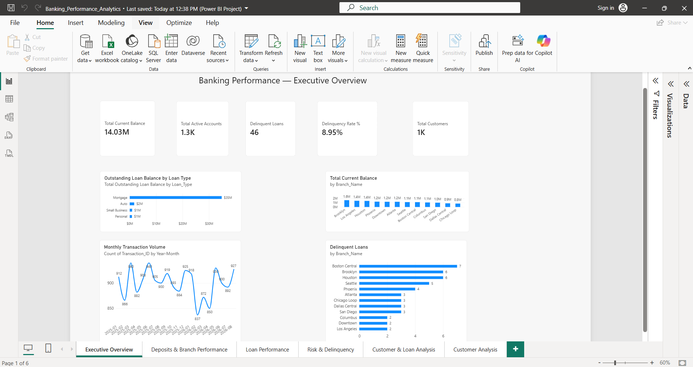
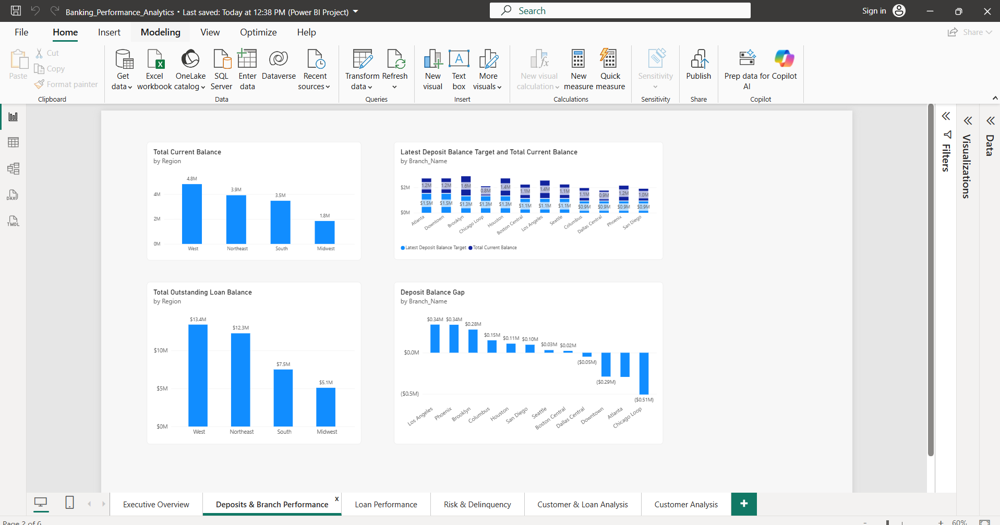
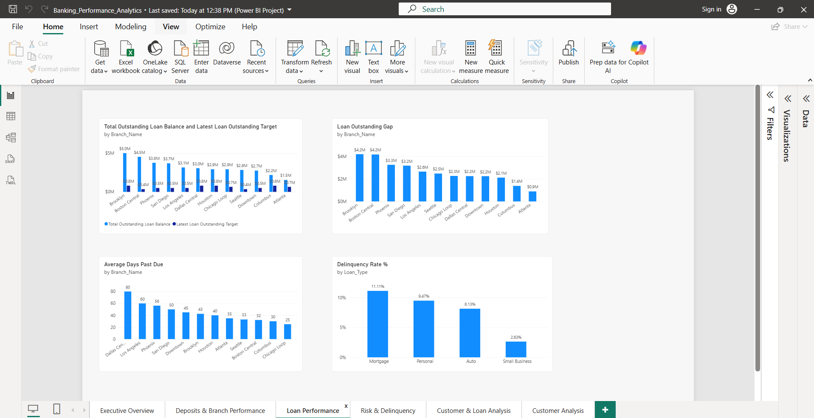
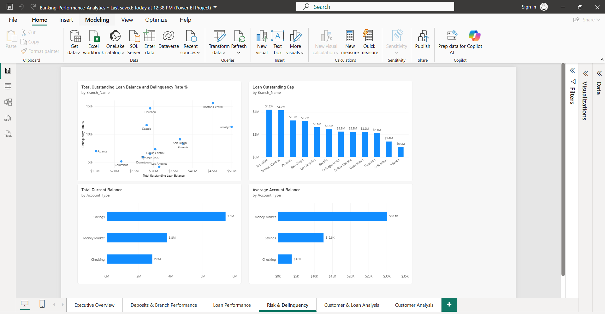
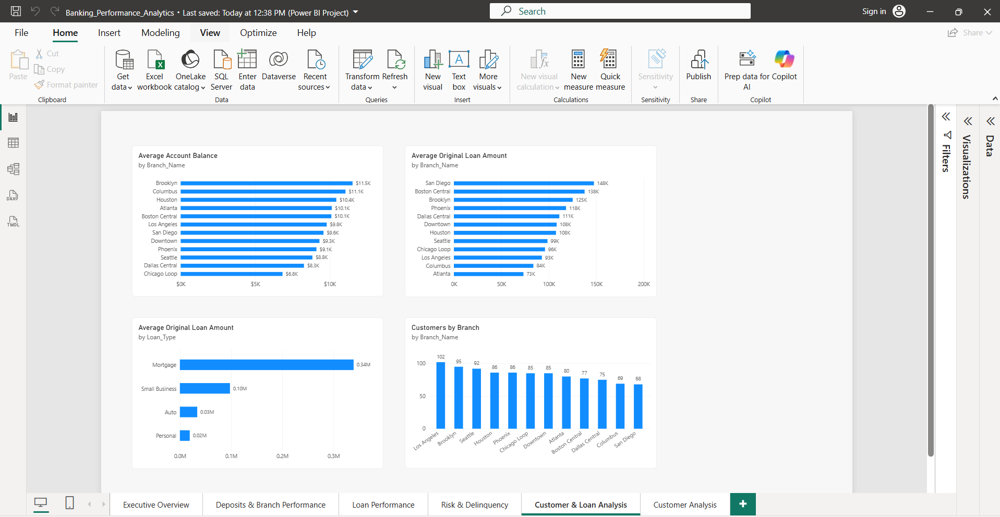
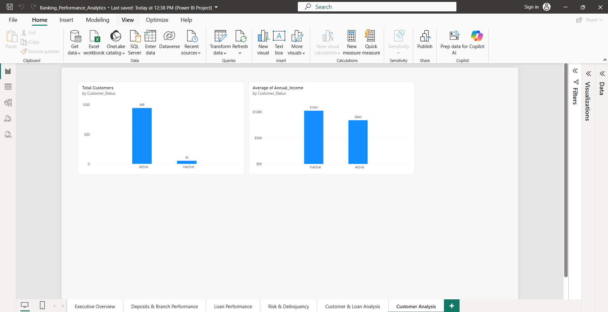

# Banking Performance Analytics

## Project Overview

I built this project to analyze the overall performance of a banking business using Power BI.

The dataset included information related to customers, bank accounts, deposits, loans, branches, loan targets, and delinquency. Instead of looking at these areas separately, I wanted to build one report that gives a broader view of how the bank is performing.

I started by understanding and cleaning the data, then created the data model and measures needed for the analysis. After that, I built the dashboard around practical business questions that a banking manager might want to answer.

The final report has six pages:

- Executive Overview
- Deposits & Branch Performance
- Loan Performance
- Risk & Delinquency
- Customer & Loan Analysis
- Customer Analysis

## What I Wanted to Find Out

Before building the dashboard, I focused on questions that could actually be useful for understanding banking performance.

Some of the main questions were:

- How much money is currently held in customer accounts?
- How are deposits performing?
- Which branches are performing better than others?
- What is the overall loan portfolio?
- How are loans performing against targets?
- Where is delinquency risk higher?
- Which loan types have more outstanding balances?
- How do customer characteristics relate to loan activity?
- How many customers are active or inactive?
- Are there differences in income between different customer groups?

The goal was to make the dashboard useful for both performance monitoring and identifying areas that may need more attention.

## Data Preparation

Before creating the visuals, I checked the data in Power Query to make sure it was suitable for analysis.

I reviewed the column data types, missing values, errors, duplicates, and consistency of the data. I also checked the important ID fields and made sure the tables could be connected correctly.

I tried not to remove or change data unless there was a clear reason. The purpose of the cleaning process was to make the data reliable while keeping useful business information.

Once the data was ready, I moved to the data model.

## Data Model

I created relationships between the banking tables so information from customers, accounts, deposits, loans, branches, and targets could work together in the report.

The model was designed so that filters could move through the related tables correctly without creating unnecessary or ambiguous relationships.

I also used the available date information for time-based analysis where it was needed.

Building the model first made it easier to create measures that could respond correctly when the dashboard was filtered.

## Measures

After the data model was ready, I created measures for the main banking KPIs and analysis.

Some of the measures used in the project include:

- Total Customers
- Total Accounts
- Total Current Balance
- Total Deposit Balance
- Total Loans
- Total Loan Outstanding
- Total Active Accounts
- Average Original Loan Amount
- Latest Deposit Amount
- Latest Loan Outstanding
- Delinquency Rate

These measures were then used across the different dashboard pages depending on the business question being analyzed.

## Dashboard Pages

### 1. Executive Overview

The Executive Overview gives a high-level picture of the bank's overall performance.

I used this page to bring the most important banking KPIs together so that a manager can quickly understand the current position before going into more detailed analysis.

### 2. Deposits & Branch Performance

This page focuses on deposit activity and branch-level performance.

The purpose was to understand how deposits are distributed and compare performance across branches. This makes it easier to identify branches that are performing strongly and branches that may require further investigation.

### 3. Loan Performance

The Loan Performance page focuses on the bank's lending activity.

I used this page to analyze loan balances, loan performance, and differences across the loan portfolio. It gives a clearer picture of how lending contributes to the overall banking business.

### 4. Risk & Delinquency

This page looks specifically at lending risk.

I analyzed delinquency so that areas with higher repayment risk could be identified. This is important because strong loan volume alone does not mean the loan portfolio is healthy.

### 5. Customer & Loan Analysis

This page connects customer information with lending activity.

The purpose was to understand the relationship between customers and their loans rather than analyzing the loan portfolio only at an overall level.

This provides another layer of information that can help explain who is using the bank's lending products.

### 6. Customer Analysis

The final page focuses specifically on the customer base.

I compared active and inactive customers and looked at customer characteristics such as annual income. This helps give a better understanding of the customers behind the bank's accounts and loan activity.

## Key Takeaways

Working through the dashboard showed me why banking performance should not be evaluated using only one metric.

Deposits and account balances help show the funding side of the business, while loans show how the bank is using those funds. At the same time, delinquency needs to be considered because higher lending activity can also increase risk.

Branch-level analysis is useful because overall bank performance can hide differences between individual branches.

The customer analysis also showed why customer information matters. Looking at customer status, income, accounts, and loans together provides more context than looking at financial totals alone.

## Tools Used

- Power BI
- Power Query
- DAX
- Excel

## What I Learned

This project gave me more practice working with a business problem that has several connected areas instead of focusing only on sales data.

I worked with customer, account, deposit, loan, branch, target, and delinquency information and learned how these different parts of a banking business can be analyzed together.

I also got more practice with data cleaning, relationships, DAX measures, KPI selection, filters, and choosing visuals based on the question I was trying to answer.

One of the main things I learned from this project is that a dashboard should not just display numbers. The numbers need to be organized in a way that helps someone understand performance, compare different areas, and identify where further investigation may be needed.

## Dashboard Preview

### Executive Overview

### Deposits & Branch Performance

### Loan Performance

### Risk & Delinquency

### Customer & Loan Analysis

### Customer Analysis

